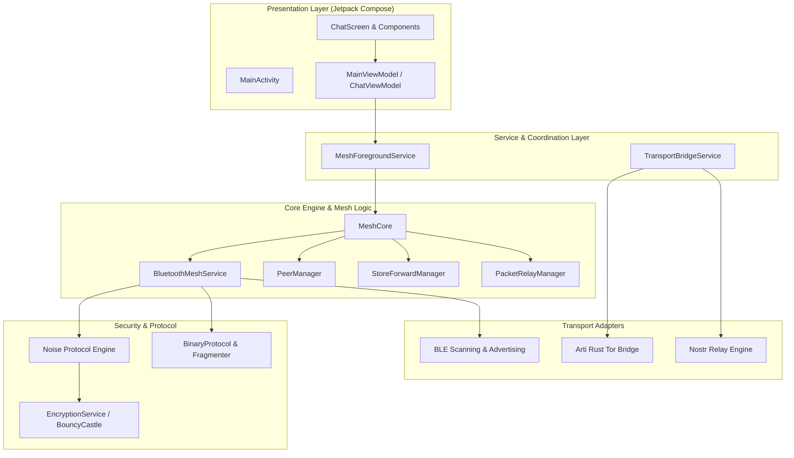

<p align="center">
  
</p>

<h1 align="center">Campus Mesh (bitchat for Android)</h1>

<p align="center">
  <strong>Decentralized, off-grid peer-to-peer messaging built for privacy, censorship resistance, and zero-server communications.</strong>
</p>

<p align="center">
  <a href="https://github.com/permissionlesstech/bitchat-android/releases"></a>
  <a href="LICENSE.md"></a>
  <a href="https://developer.android.com"></a>
  <a href="https://kotlinlang.org"></a>
  <a href="https://developer.android.com/develop/ui/compose"></a>
</p>

---

> [!WARNING]
> **Security Notice**: This software is under active development and has not yet undergone an independent, formal third-party cryptographic security audit. Do not rely on it as a sole means of security for critical or life-safety situations.

---

## Table of Contents

- [Overview](#overview)
- [Key Features](#key-features)
- [Architecture & Design](#architecture--design)
- [IRC Slash Commands](#irc-slash-commands)
- [Installation](#installation)
- [Building from Source](#building-from-source)
- [Permissions & Hardware](#permissions--hardware)
- [Cross-Platform Compatibility](#cross-platform-compatibility)
- [Security & Privacy Model](#security--privacy-model)
- [Documentation & License](#documentation--license)

---

## Overview

**Campus Mesh** (bitchat Android) is a privacy-first, off-grid communication application designed to operate without central servers, cell towers, or internet infrastructure. Utilizing **Bluetooth Low Energy (BLE)** multi-hop mesh networking, devices discover each other automatically, forming an ad-hoc decentralized network that routes encrypted text, voice, and media across distant peers.

When an internet connection is present, Campus Mesh seamlessly expands its capabilities through **Geohash channels**, **Nostr protocol relays**, and a built-in **Tor/Arti Rust bridge** for anonymous, serverless wide-area communication.

This client is 100% protocol-compatible with the original [bitchat iOS client](https://github.com/jackjackbits/bitchat), enabling seamless cross-platform communication between Android and iOS devices in the same physical vicinity.

---

## Key Features

### Off-Grid Mesh & Transport
- **Multi-Hop Relaying**: Messages hop across up to 7 intermediate devices (TTL-based routing) to reach peers beyond direct Bluetooth range.
- **Store & Forward**: Messages for offline peers are cached locally and automatically delivered when the target peer re-enters the mesh network.
- **Wi-Fi Aware & BLE Integration**: Dual-transport capabilities for high-density, low-latency local discovery and data transfer.
- **Smart Routing & Bloom Filters**: Suppresses relay loops and redundant network floods using optimized Bloom filters.

### End-to-End Cryptography
- **Noise Protocol Framework**: Secure channel handshake and noise session state machines.
- **X25519 Key Exchange**: Forward-secret session key agreement for private 1-on-1 messaging.
- **AES-256-GCM & ChaCha20-Poly1305**: Authenticated payload encryption preventing eavesdropping and tampering.
- **Ed25519 Digital Signatures**: Verifies message origin and integrity.
- **Emergency Panic Wipe**: Instant triple-tap action on the header logo to wipe all keys, database records, and cached messages from device storage.

### Privacy & Anonymity
- **No Accounts or Phone Numbers**: Uses randomly generated, cryptographic ephemeral identity keypairs without PII collection.
- **Built-in Tor / Arti Rust Bridge**: Integrated Arti Rust client compiled for Android (`jniLibs`) provides onion routing without requiring external Orbot apps.
- **Nostr Relay Extension**: Connects to decentralized Nostr relays for global channel fallback when online.
- **Geohashing**: Location-based spatial channels without storing precise user coordinates.

### Rich Messaging & Slash Commands
- **IRC-Style Interface**: Intuitive command-line interface with full slash-command auto-completion (`/j`, `/m`, `/w`, `/pass`, `/save`, etc.).
- **Channel Security**: Password-protected channels (`/pass`) with Argon2id key derivation.
- **Voice & Media Sharing**: Compressed audio notes and file chunking for rich media over low-bandwidth mesh links.
- **Mentions & Receipts**: `@nickname` autocomplete, delivery status indicators, and RSSI signal quality badges.

### Battery & Performance
- **Adaptive Power Management**: Dynamically shifts scanning duty cycles between *Performance*, *Balanced*, *Power Saver*, and *Ultra-Low Power* depending on battery percentage and charging status.
- **LZ4 Compression**: Automatically compresses payload content >100 bytes for 30-70% bandwidth reduction over BLE.

---

## Architecture & Design

Campus Mesh follows modern Android development standards using Clean Architecture with MVVM, Jetpack Compose, and Kotlin Coroutines/Flow.



### Module Breakdown

| Package | Purpose | Primary Components |
| :--- | :--- | :--- |
| [`ui/`](file:///Users/dankwawadie/Desktop/Campus_Mesh/app/src/main/java/com/campusmesh/android/ui) | **Presentation**: Declarative Composables, Material 3 theme, navigation, dialogs. | `ChatScreen.kt`, `ChatViewModel.kt`, `Theme.kt` |
| [`service/`](file:///Users/dankwawadie/Desktop/Campus_Mesh/app/src/main/java/com/campusmesh/android/service) | **Service Layer**: Background persistence and system lifecycle services. | `MeshForegroundService.kt`, `TransportBridgeService.kt` |
| [`mesh/`](file:///Users/dankwawadie/Desktop/Campus_Mesh/app/src/main/java/com/campusmesh/android/mesh) | **Mesh Core**: BLE scanning/advertising, connection tracking, store & forward, power policy. | `MeshCore.kt`, `BluetoothMeshService.kt`, `PowerManager.kt` |
| [`protocol/`](file:///Users/dankwawadie/Desktop/Campus_Mesh/app/src/main/java/com/campusmesh/android/protocol) | **Wire Protocol**: Binary serialization, packet headers, fragmentation engine. | `BinaryProtocol.kt`, `FragmentManager.kt` |
| [`crypto/`](file:///Users/dankwawadie/Desktop/Campus_Mesh/app/src/main/java/com/campusmesh/android/crypto) | **Cryptography**: Key management, AES-GCM, Ed25519, X25519 operations. | `EncryptionService.kt`, `KeyManager.kt` |
| [`noise/`](file:///Users/dankwawadie/Desktop/Campus_Mesh/app/src/main/java/com/campusmesh/android/noise) | **Noise Handshake**: Noise Protocol Framework implementation. | `NoiseSession.kt`, `NoiseHandshake.kt` |
| [`nostr/`](file:///Users/dankwawadie/Desktop/Campus_Mesh/app/src/main/java/com/campusmesh/android/nostr) | **Nostr Integration**: Relay WebSocket connections, event publishing, subscription filters. | `NostrRelayManager.kt`, `NostrService.kt` |
| [`geohash/`](file:///Users/dankwawadie/Desktop/Campus_Mesh/app/src/main/java/com/campusmesh/android/geohash) | **Geolocation**: Geohash grid calculation and spatial channel management. | `GeohashManager.kt`, `LocationService.kt` |
| [`features/`](file:///Users/dankwawadie/Desktop/Campus_Mesh/app/src/main/java/com/campusmesh/android/features) | **Media & Voice**: Audio recording, playback, and file chunk transport. | `VoiceMessageManager.kt`, `FileTransferManager.kt` |

---

## IRC Slash Commands

Campus Mesh features an integrated command parser supporting standard IRC-style control flow:

| Command | Arguments | Scope | Description |
| :--- | :--- | :---: | :--- |
| `/j` or `/join` | `#channel` | Global | Join or create a mesh channel |
| `/m` or `/msg` | `@nickname message` | DM | Send an end-to-end encrypted private message |
| `/w` or `/who` | *none* | Global | List all active mesh peers in range |
| `/channels` | *none* | Global | List all discovered active channels |
| `/pass` | `[password]` | Channel | Set or remove channel password (*Channel Owner*) |
| `/save` | *none* | Channel | Toggle mandatory message retention (*Channel Owner*) |
| `/transfer` | `@nickname` | Channel | Transfer channel ownership to another peer |
| `/block` | `@nickname` | Global | Block a peer from sending messages to you |
| `/unblock` | `@nickname` | Global | Remove a peer from your blocked list |
| `/clear` | *none* | Local | Clear current chat transcript from view |

---

## Installation

### Option 1: GitHub Releases (Direct APK)
Download the latest APK directly from our [GitHub Releases Page](https://github.com/permissionlesstech/bitchat-android/releases).

We publish architecture-optimized APKs for best performance and smaller download size:
- **`app-arm64-v8a-release.apk`**: Recommended for modern Android smartphones.
- **`app-x86_64-release.apk`**: For Android emulators and x86_64 devices.
- **`app-universal-release.apk`**: Universal build containing all architectures.

### Option 2: Google Play Store
Available on Google Play:
[](https://play.google.com/store/apps/details?id=edu.gctu.campusmesh)

---

## Building from Source

### Prerequisites
- **Android Studio**: Ladybug (2024.2.1+) or newer
- **JDK**: Java 17+
- **Android SDK**: API level 34 (Target), API level 26 (Minimum - Android 8.0)
- **NDK**: 26.1+ (required if modifying Tor Arti Rust C-bindings)

### Build Steps

1. **Clone the repository:**
   ```bash
   git clone https://github.com/permissionlesstech/bitchat-android.git
   cd bitchat-android
   ```

2. **Build Debug APK:**
   ```bash
   ./gradlew assembleDebug
   ```

3. **Install Debug APK to connected device:**
   ```bash
   ./gradlew installDebug
   ```

4. **Build Production Release APKs:**
   ```bash
   ./gradlew assembleRelease
   ```
   *APKs will be generated in `app/build/outputs/apk/release/`.*

5. **Build Android App Bundle (AAB for Play Store):**
   ```bash
   ./gradlew bundleRelease
   ```

6. **Run Unit Tests:**
   ```bash
   ./gradlew test
   ```

---

## Permissions & Hardware

### Android Permissions
Campus Mesh requests only essential permissions required for hardware mesh communication:

- **Bluetooth Scan, Connect, & Advertise** (`Android 12+`): Discovers and connects to surrounding mesh nodes over BLE.
- **Fine / Coarse Location**: Required by the Android OS for BLE peripheral scanning (Location data is **never** uploaded or shared).
- **Foreground Service (`CONNECTED_DEVICE`)**: Keeps the background mesh relay active when the app is minimized.
- **Post Notifications**: Delivers incoming message alerts and connection status updates.
- **Record Audio** *(Optional)*: Required only when recording voice messages.

### Hardware Requirements

| Component | Minimum | Recommended |
| :--- | :--- | :--- |
| **Android OS** | Android 8.0 (API Level 26) | Android 12.0+ (API Level 31+) |
| **Bluetooth** | Bluetooth 4.2 LE | Bluetooth 5.0+ LE with Extended Advertising |
| **RAM** | 2 GB | 4 GB+ |
| **Storage** | 50 MB | 200 MB |

---

## Cross-Platform Compatibility

Campus Mesh Android maintains **100% binary wire-protocol parity** with the [bitchat iOS app](https://github.com/jackjackbits/bitchat):

- **Header Parity**: Standard 13-byte header layout with identical field offsets and bit flags.
- **Cross-Platform Mesh Routing**: Android and iOS devices act seamlessly as transit nodes for each other's packets.
- **Crypto Compatibility**: Shared X25519 key derivation, AES-256-GCM cipher parameters, and Noise handshake patterns.
- **Fragmentation**: Compatible packet chunking (150-byte MTU fragment frames) preventing BLE buffer drops across OS boundaries.

---

## Security & Privacy Model

Campus Mesh is architected with a **Zero-Trust Network Model**:

1. **No Central Authorities**: No identity servers, registration endpoints, or authentication brokers.
2. **Ephemeral Identity**: Keys can be rotated at any time. Identity is tied strictly to local cryptographic keypairs.
3. **Traffic Analysis Defense**: Random jitter timing and cover traffic discourage timing-correlation attacks.
4. **Panic Wipe**: Triple-tapping the app header icon instantly triggers zeroization of all cryptographic keys and local databases.

---

## Documentation & License

- **Architecture Guide**: See [`AGENTS.md`](AGENTS.md) for codebase organization guidelines.
- **Release History**: See [`CHANGELOG.md`](CHANGELOG.md) for version release notes.
- **Privacy Policy**: Read our zero-data collection [`PRIVACY_POLICY.md`](PRIVACY_POLICY.md).
- **License**: Released under **Public Domain / Unlicense**. See [`LICENSE.md`](LICENSE.md) for details.

---

<p align="center">
  Built for decentralized communication, privacy, and censorship resistance.
</p>
